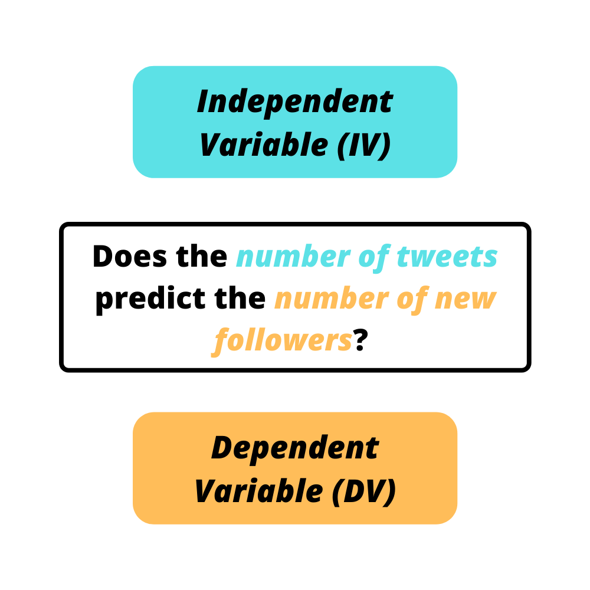

```{r setup, include=FALSE}
knitr::opts_chunk$set(echo = TRUE, fig.align = 'center')
```

# Learning Objectives

* Understand independent and dependent variables.
* Understand the shape of lines.
* Understand how we might fit a line to data.


We are interested in **bivariate** data with:

* one **independent** variable (AKA IV, predictor variable, explanatory variable), which we call $x$ by convention.
* one **dependent** variable (AKA DV, response variable, outcome variable) that we call $y$ by convention.

For example, take a situation where we want to know whether tweeting more means more new followers. Here, the **number of new tweets is the independent variable** and the **number of new followers is the dependent variable**. We are interested in answering whether the dependent variable _depends_ on the independent variable.

This could also be phrased as:

  * Does the explanatory variable _explain_ the outcome
  * Does the predictor variable _predict_ the response?

<center>
{#id .class width=40% height=40%}
</center>
However, you may be saying to yourself: surely the number of tweets isn't the only thing that would have an effect on the number of new followers! What about the type of content being tweeted, the number of tags used, or how many followers you have to begin with? 

Well, we can have more than one independent variable, which is very common when building models to try and predict an outcome as accurately as possible. But for now we will keep it basic and stick to a single independent variable $x$ and a single dependent variable $y$. You'll learn about multiple linear regression later in the week!

<hr>

# Lines

The general form of a line is 

$$y=a \times x+b$$
We call $a$ the **gradient**. You can think of this as the answer to the question "How many units of $y$ do we travel if we travel one $x$ unit to the right?". 

* A large positive value means a steep, upward sloping line. 
    * e.g. $a=6$: we go $6$ units upward along $y$ for every $1$ unit rightward along $x$.  
* A large negative value means a steep, downward sloping line.
    * e.g. $a=-4$: we go $4$ units downward along $y$ for every $1$ unit rightward along $x$.

<blockquote class='task'>
**Task - 2 mins**. What does gradient $a=0$ mean? What does a line with $a=0$ look like?
<details>

<summary>**Solution**</summary>
Following the same analyses as above, a gradient of $0$ means we don't move upward or downward along $y$ at all, no matter how far we move along $x$. So a line with $a=0$ will be parallel to the $x$-axis.  
</details>
</blockquote>

Parameter $b$ is called the **intercept**. This answers the question "Where does the line cross the $y$-axis?"

Let's plot a line 

```{r, warning = F, message = F}
library(tidyverse)

# let's write our own line function
line <- function(x, a, b){
  return(a * x + b)
}

# set up x vector and use line() to compute y values
data <- tibble(
  x = seq(-5, 5, 0.1),
  y = line(x, a = 2, b = -1)
)

data %>%
  ggplot(aes(x, y)) +
  geom_line(col = "red") +
  geom_vline(xintercept = 0) +
  geom_hline(yintercept = 0)

```

<blockquote class='task'>
**Task - 5 mins** 

* Play around plotting two or three different lines. 
   - Try a line with $a=0$ and positive $b$.
   - You can use `mutate()` to overwrite `y` in `data` from above
* Can we use our `line()` function to plot a perfectly vertical line? 

<details>
<summary>**Solution**</summary>

Let's try $a=-1$ and $b=2$
```{r}
data %>%
  mutate(y = line(x, a = -1, b = 2)) %>%
  ggplot(aes(x, y)) +
  geom_line(col = "red") +
  geom_vline(xintercept = 0) +
  geom_hline(yintercept = 0)
```

and $a=0$ and $b=4$
```{r}
data %>%
  mutate(y = line(x, a = 0, b = 4)) %>%
  ggplot(aes(x, y)) +
  geom_line(col = "red") +
  geom_vline(xintercept = 0) +
  geom_hline(yintercept = 0)
```

We can't use `line()` to draw a perfectly vertical line, as the gradient of such a line is mathematically not defined! We'd need to specify it instead as something like $x=2$
</details>
</blockquote>

# Fitting a line to data

Why do we want to fit functions to data?


Consider a scenario where we have data on temperature and ice cream sales that follow a linear relationship, where:

  * __Independent Variable: Temperature__
  * __Dependent Variable: Ice Cream Sales__
  
In this situation there are two main reasons we want to find functions that fit our data. 

1. The first reason is that our data is complicated! If we can represent it with a single mathematical function, that's much easier to understand. We can make simple statements like "For every increase in one degree of temperature ice cream sales increase by 5".

2. The second reason is we might want to make predictions. Using our mathematical function we can now predict the number of ice cream sales for any temperature. If it ever reached 30 degrees in Scotland, how many ice creams would we expect to sell? 

Let's see an example of some data for which a linear fit would be a good choice!

```{r, message = F}
noisy_line <- read_csv("data/noisy_line.csv")

noisy_line_plot <- noisy_line %>%
  ggplot(aes(x, y)) +
  geom_point()
noisy_line_plot
```

Now let's calculate the centroid position and add it to the plot

```{r}
centroid <- noisy_line %>%
  summarise(
    x = mean(x),
    y = mean(y)
  )
centroid

noisy_line_plot <- noisy_line_plot +
  geom_point(aes(x = centroid$x, y = centroid$y), col = "red", size = 5)
noisy_line_plot
```

So our best fit line has to pass through the centroid. You can think of this as finding the answer to the question "which line passing through the red dot (centroid) lies 'closest' to all the data points?". We'll see in the next lesson what we mean by 'closest'.

We vary the gradient $a$ while respecting the equation $\bar{y}=a \times \bar{x} + b$. In practice, this means we treat $a$ as free, and reverse the equation to give us $b$: 

$$b = \bar{y} - a \times \bar{x}$$

```{r}
get_intercept <- function(slope, centroid_x, centroid_y){
  return(centroid_y - slope * centroid_x)
}
```


```{r}
slope = 0.5
noisy_line_plot +
  geom_abline(slope = slope, intercept = get_intercept(slope, centroid$x, centroid$y))
```

<br>
<blockquote class='task'>
**Task - 5 mins**

Play around with the code chunk above and try to find a `slope` that fits the data reasonably well.

```{r, eval = FALSE}
slope = 0.5
noisy_line_plot +
  geom_abline(slope = slope, intercept = get_intercept(slope, centroid$x, centroid$y))
```

<details>
<summary>**Solution**</summary>

We can estimate a reasonable slope by noting that, across the range of data, $x$ varies by $10$, while $y$ varies by $20$, so a slope of $2$ seems like a good guess

```{r}
slope = 2
noisy_line_plot +
  geom_abline(slope = slope, intercept = get_intercept(slope, centroid$x, centroid$y))
```

</details>
</blockquote>
<br>

Most of the line fitting methods we will see in this course will put the 'best fit' line through the centroid by design!

```{r}
noisy_line_plot + 
  geom_smooth(method = "lm", se = FALSE)
```

We'll see what `method = "lm"` does in the next lesson!


## The principle of parsimony

There are many different functions we could try to fit to our data. Here we have only looked at a straight line, but you can imagine more complicated functions to fit different patterns in data. So considering all these options, how do we decide what function type to fit to data? Take the following principle as a guide.

<br>
<div class='emphasis'>
**The principle of parsimony**, also known as **Occam's razor** is a fundamental scientific principle. 
<br><br>
In a general sense, it says that:

<br>
<center>
*Given two or more 'explanations' of comparable quality, the _simplest_ explanation is the _best_ one.*
</center>
<br>

Applied to statistics it tells us that:

* fitting models should have as few adjustable parameters as possible (i.e. models should be simplified until they are 'minimal adequate')
* experiments should have as few assumptions as possible
* linear models should be tried prior to non-linear models

<br>
But don't take parsimony too far, keep in mind the following recommendation by Einstein:

<br>
<center>
*'Everything should be made as simple as possible, but not simpler.'*
</center>
<br>

</div>
<br>

<hr>


# Additional resources

* The [Khan Academy Algebra I course](https://www.khanacademy.org/math/algebra) is an excellent resource to dip into!
* [Linear Equations by Math is Fun](https://www.mathsisfun.com/algebra/linear-equations.html)
* [Explore the properties of a straight line](https://www.mathsisfun.com/data/straight_line_graph.html)