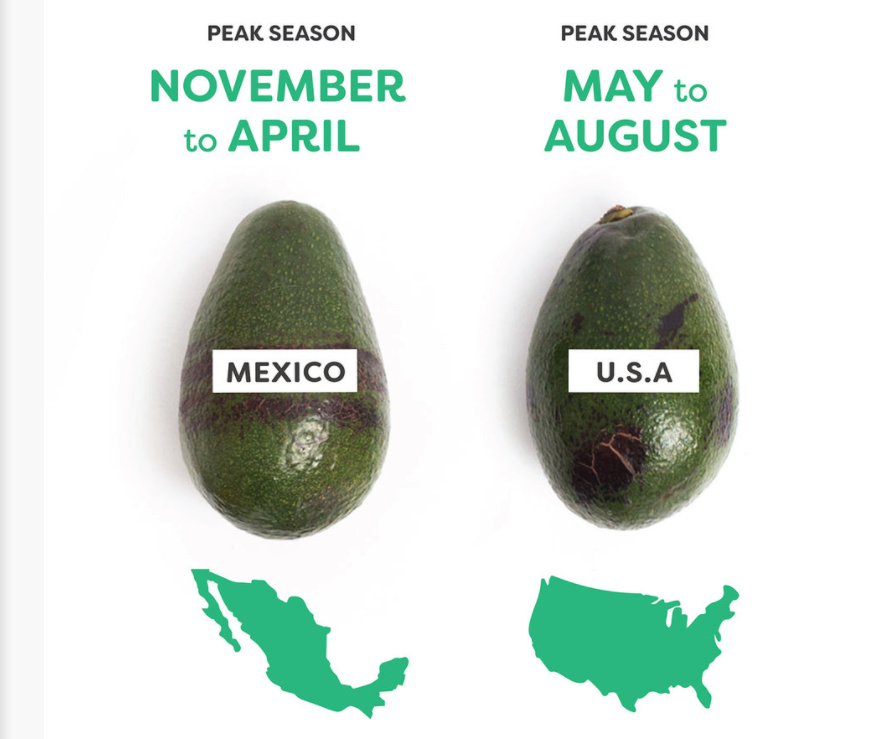

```{r setup, include=FALSE}
knitr::opts_chunk$set(echo = TRUE)

library(lubridate)
library(janitor)
library(tidyverse)
library(modelr)
library(GGally)
library(leaps)
library(caret)
library(broom)
```

# Reading in the Data

```{r}
avocados <- read_csv("data/avocado.csv") %>%
  clean_names()

knitr::kable(head(avocados))
```

# Understanding the Variables 

* #### index
* #### Date: The date of the observation
* #### AveragePrice: the average price of a single avocado
* #### Total Volume: Total number of avocados sold
* #### 4046: Total number of avocados with PLU 4046 sold
* #### 4225: Total number of avocados with PLU 4225 sold
* #### 4770: Total number of avocados with PLU 4770 sold
* #### Total Bags
* #### Small Bags
* #### Large Bags
* #### XLarge Bags
* #### type: conventional or organic
* #### year: the year
* #### region: the city or region of the observation

# Cleaning the data

## Cleaning the Date

* #### I wanted to extract out the seasonal variations found in the time series data when plotted against average price

```{r}
avocados_date <- avocados %>%
  mutate(month = month(date, label = TRUE),
         season = case_when(
         month %in% c("Dec", "Jan", "Feb") ~ "Winter",
         month %in% c("Jun", "Jul", "Aug") ~ "Summer",
         month %in% c("Sep", "Oct", "Nov") ~ "Autumn",
         TRUE ~ "Spring")) 

knitr::kable(head(avocados_date %>%
                    select(average_price, date, month, season)))
```
```{r}
avocados_date %>%
  ggplot() +
  geom_smooth(aes(x = date, y = average_price, colour = type))
```

* #### Avocados are a seasonal fruit, so to compress down the amount of information contained in the date, I mutated in the season to find variations

* #### The table above just shows how date was mutated to month and then to season.

## Removing Variables 

```{r}
avocados_trim <- avocados_date %>%
  select(-c(x1, date, year, region, month))

knitr::kable(head(avocados_trim))
```

* #### Next I removed the time series variables, index and region

* #### I chose to remove region as it would create too many dummy variables in the when runnning a linear regression model

## Check for Missing Values

```{r}
summary(avocados_trim)
```

* #### _Whoop Whoop! No missing values here_

# Using ggpairs to find Correlation to Average Price

```{r}
avocados_trim %>%
  ggpairs(aes(), columns = 1:4)
```

```{r}
avocados_trim %>%
  ggpairs(aes(), columns = c(1,5:8))
```

```{r}
avocados_trim %>%
  ggpairs(aes(), columns = c(1,9:11))
```

* #### From the correlational plots we can see that type and then season are the most highly correlated with the average price

```{r, eval = FALSE}
# Looking at ggcorr() here


# avocados_trim_01 <- avocados_trim %>%
#   dplyr::select(1:6)
# 
# avocados_trim_02 <- avocados_trim %>%
#   dplyr::select(1, 7:11)
# 
# ggcorr(data  = avocados_trim_02,
#        label = TRUE,
#        label_size = 5) +
#   ggtitle("Correlation Plot for Penguins by Species")
```

## Taking a closer look at the season (and month)

```{r}
avocados_date %>%
  ggplot() +
  geom_boxplot(aes(x = month, y = average_price)) 
```

```{r}
avocados_date %>%
  ggplot() +
  geom_boxplot(aes(x = season, y = average_price)) 
```
* #### We can see from the month data that there are definite seasonal fluctuations.

* #### To bring some context to these plots, we have found that most avocados imported into the U.S come from Mexico, while some are grown domestically in regions like california. See plot below.

{width=100%}

* #### _source - https://pdf.usaid.gov/pdf_docs/PA00KP28.pdf_

<br>

* #### The growing season for the avocados in Mexico and the U.S. are are shown below.

{width=100%}

* #### _source - http://blog.imperfectfoods.com/blog-1/2019/2/13/when-are-avocados-in-season_


```{r}
avocados %>%
  ggplot() +
  geom_point(aes(x = average_price, y = x4046), colour = "steel blue") +
  geom_point(aes(x = average_price, y = x4225), colour = "red") +
  geom_point(aes(x = average_price, y = x4770), colour = "green") 

# x4046 - non-organic small/medium Hass Avocados
# x4225 - non-organic large Hass Avocados  
# x4770 - non-organic extra large Hass Avocados

# Mutating useful information out of the date variable 

# We know avocados are seasonal, so is there a supply demand dynamic at all to be obersved?

# mutate to month and season?

avocados_date %>%
  ggplot() +
  geom_boxplot(aes(x = month, y = average_price)) 

avocados_date %>%
  ggplot() +
  geom_boxplot(aes(x = season, y = average_price)) 

# uptick in the price around the autumn months

# mutate in a season variable we see the different in the seasons while reducing the number of variables 

# Mexico is the largest avocado exporter by an order of magnitude. It is likely that all americas avocados are coming from there. Harvesting begins in early spring spring 

# Image

# source - http://blog.imperfectfoods.com/blog-1/2019/2/13/when-are-avocados-in-season

# Regions

unique(avocados$region)

avocados %>%
  ggplot() +
  geom_boxplot(aes(y = average_price, x = reorder(region, average_price))) +
  theme(axis.text.x = element_text(angle = 90, vjust = 0.5, hjust=1))

# Definite correlation between region and price but the number of dummy variables needed to be included would be ridiculous.


summary(avocados)
# No NA'S Whoop Whoop

# Type

unique(avocados$type)

avocados %>%
  ggplot() +
  geom_boxplot(aes(x = type, y = average_price))

avocados_trim <- avocados_date %>%
  select(-c(x1, date, year, region, month))
```
{width=100%}
# Understanding the variables

* #### index
* #### Date: The date of the observation
* #### AveragePrice: the average price of a single avocado
* #### Total Volume: Total number of avocados sold
* #### 4046: Total number of avocados with PLU 4046 sold
* #### 4225: Total number of avocados with PLU 4225 sold
* #### 4770: Total number of avocados with PLU 4770 sold
* #### Total Bags
* #### Small Bags
* #### Large Bags
* #### XLarge Bags
* #### type: conventional or organic
* #### year: the year
* #### region: the city or region of the observation

## Variables to remove

* #### index, date, year will all not be indicative of the price of avocados 

* #### May have to reinclude the date - split by month - may be indicative of average price due to supply demand dynamics

```{r}
avocados_trim %>%
  ggpairs(aes(), columns = 1:4)

avocados_trim %>%
  ggpairs(aes(), columns = c(1,5:8))

avocados_trim %>%
  ggpairs(aes(), columns = c(1,9:11))

# type looks most correlated

avocados_date %>%
  ggplot() +
  geom_smooth(aes(x = date, y = average_price, colour = type))

```

# Model building

```{r}
regsubsets_forward <- regsubsets(average_price ~ ., data = avocados_trim, nvmax = 8, method = "forward")

sum_regsubsets_forward <- summary(regsubsets_forward)

# 1. type_organic
# 2. season_winter
# 3. season_spring

# Most significant variables in order in the automated model

# All variables are false
```

```{r}
plot(regsubsets_forward, scale = "adjr2")

# We see the drop off in the adjusted r squared value comes to 0.44 by about 5 variables
```

```{r}
plot(sum_regsubsets_forward$rsq, type = "b")
```

```{r}
plot(sum_regsubsets_forward$bic, type = "b")
```

